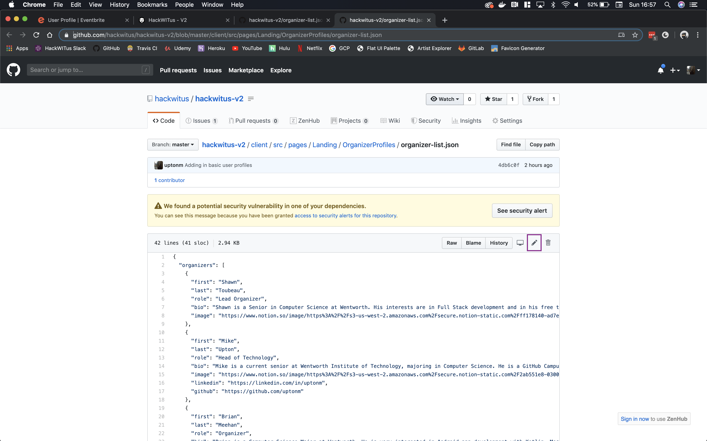
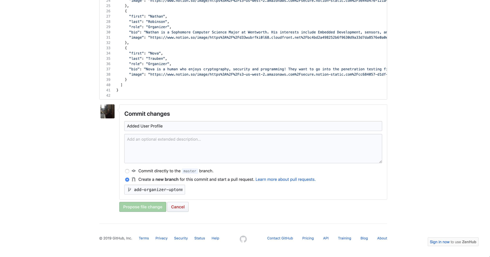
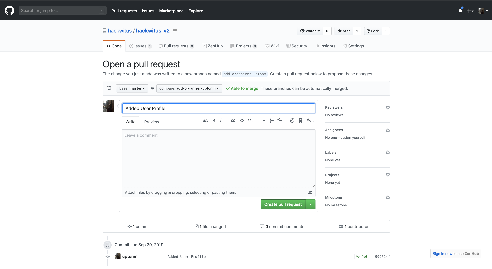

 # Adding an Organizer Profile
- First open the `organizer-list.json` file located in [here](https://github.com/hackwitus/hackwitus-v2/blob/master/client/src/pages/Landing/OrganizerProfiles/organizer-list.json).
- Click the pencil icon to edit the document


- Locate the end of the last organizer's json object
    ``` json
    {
      "first": "Mike",
      "last": "Upton",
      "role": "Head of Technology",
      "bio": "Mike is a current senior at Wentworth Institute of Technology, majoring in Computer Science. He is a GitHub Campus Expert, and an avid supporter of open-source software.",
      "image": "https://www.notion.so/image/https%3A%2F%2Fs3-us-west-2.amazonaws.com%2Fsecure.notion-static.com%2F2ab551e8-0300-4398-9740-82ce9f37faa2%2FImage_from_iOS.jpg?table=block&id=cdac301e-f31c-483d-9dfd-e48886fbae36&width=790&cache=v25",
      "linkedin": "https://linkedin.com/in/uptonm",
      "github": "https://github.com/uptonm"
    },
     ^
    ```
- Ensure that the coma is placed after their profile and paste in the following json object formatted with your personal profile info.
  ``` json
  {
    "first": "<first name>",
    "last": "<last name>",
    "role": "Organizer",
    "bio": "<bio>",
    "image": "<image link ending in .jpeg .jpg or .png>",
    "linkedin": "<linkedin profile link>",
    "github": "<github profile link>"
  }
  ```
- Fill out the commit new changes form, ensure that you click to create a new branch with the name format "add-organizer-`<your name>`"

- Click `Create pull request` to submit the changes to be reviewed by one of the developers and merged onto the site
